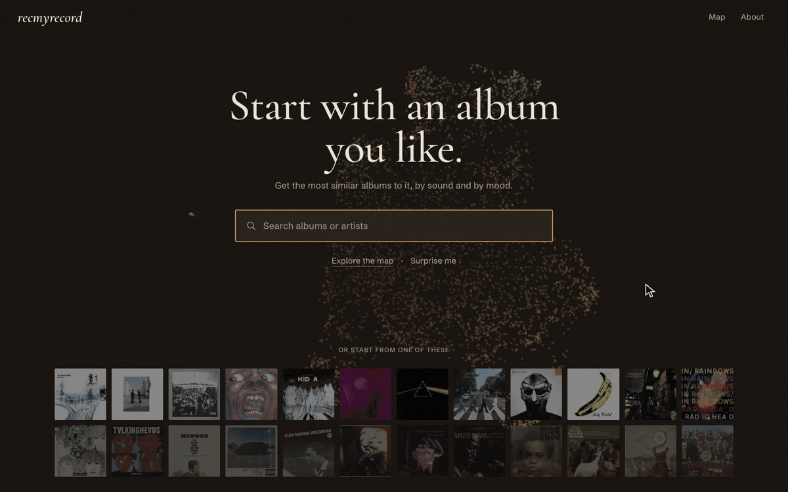
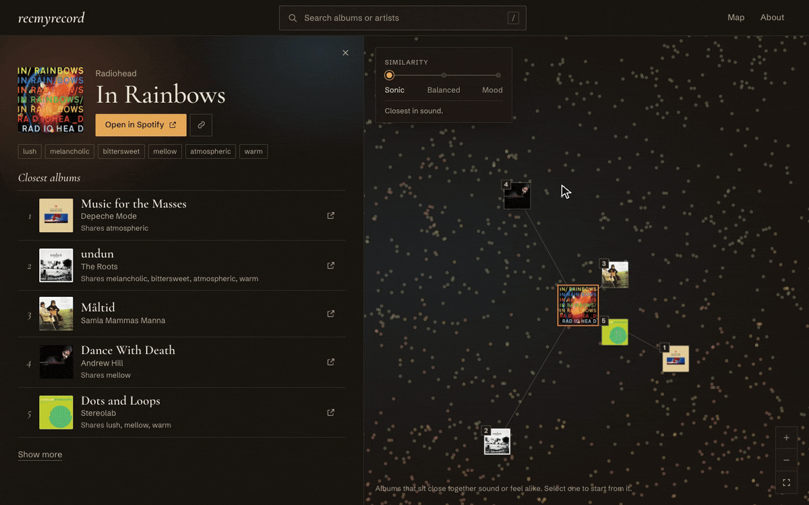
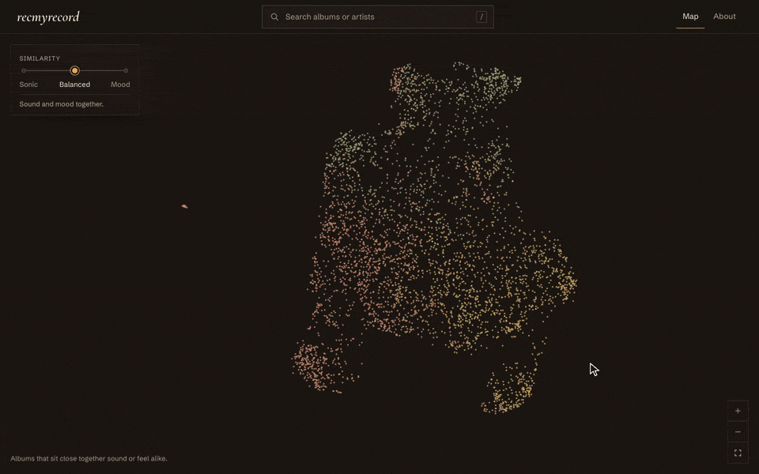
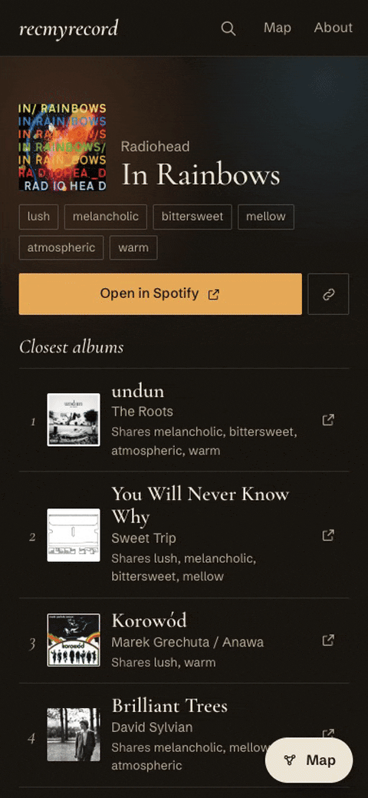

<h1 align="center">recmyrecord</h1>

<p align="center">
  Start with an album you like. Get the most similar albums to it, by sound and by mood.
  <br><br>
  <a href="https://www.recmyrecord.com"><b>recmyrecord.com</b></a>
</p>

<p align="center">
  
</p>

Every album is placed by how it sounds, using Spotify's audio values, and how it feels, using mood descriptors handpicked from RateYourMusic. Pick one and you get the albums nearest to it.

<p align="center">
  
</p>

Slide between sound and mood to change what "close" means.

<p align="center">
  
</p>

Or skip the search and wander the map: 4,000+ albums, with the ones that sound or feel alike sitting together.

<p align="center">
  
</p>

<p align="center"><a href="https://www.recmyrecord.com"><b>Try it at recmyrecord.com</b></a></p>

<br>

<details>
<summary>Running it locally</summary>

<br>

The site is a static Next.js app in `frontcreck/` and needs no environment variables. With Node 22 on arm64:

```bash
cd frontcreck
npm install
npm run dev
```

The data it serves is committed. To rebuild it, see [`data-pipeline/README.md`](data-pipeline/README.md). More detail in [`frontcreck/README.md`](frontcreck/README.md).

| Folder | Contents |
|---|---|
| `frontcreck/` | The website |
| `data-pipeline/` | Builds the data files the site serves |
| `data-retrieval/` | The original scraping and recommender code, kept for reference |

</details>
